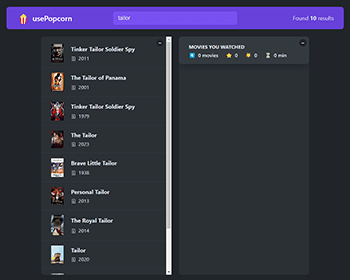

# [React-TypeScript-popcorn-app](#)

Popcorn Movie Rater is a sleek and intuitive web application built with React and TypeScript. Designed for movie enthusiasts, this app allows users to rate and review their favorite films. With a user-friendly interface and seamless navigation, Popcorn Movie Rater makes it easy to discover new movies, share opinions, and see what others think. Whether you’re a casual viewer or a film critic, this app is your go-to platform for all things movies.

[](#)

# Table of Contents

1. ⬇️ [Installation](#installation)
2. 📂 [Folder Structure](#folder-structure)
3. ⚙️ [Tech Stack](#tack-stack)
4. 🛠️ [Features](#features)
5. 🤝 [Connect With me](#contact)
6. 🧾 [Credit](#credit)

## <a name="installation">⬇️ Installation</a>

Follow these steps to set up the project locally on your machine.
**Prerequisites**
Make sure you have the following installed on your machine:

-   [Git](https://git-scm.com/)
-   [Node.js](https://nodejs.org/en)
-   [npm](https://www.npmjs.com/) (Node Package Manager)

**Cloning the Repository**

```bash
$ git clone https://github.com/prantomollick/React-TypeScript-popcorn-app.git
$ cd React-TypeScript-popcorn-app
```

**Installation**
Install the project dependencies using npm:

```bash
$ npm install
```

Running the Project

```bash
$ npm run dev
```

Open http://localhost:5173 in your browser to view the project.

## <a name="folder-structure">📂 Folder Structure</a>

```
.
├── README.md
├── eslint.config.js
├── index.html
├── package-lock.json
├── package.json
├── public
│   └── vite.svg
├── src
│   ├── App.tsx
│   ├── assets
│   │   └── react.svg
│   ├── components
│   │   ├── Box.tsx
│   │   ├── ErrorMessage.tsx
│   │   ├── Loader.tsx
│   │   ├── Logo.tsx
│   │   ├── Main.tsx
│   │   ├── Movie.tsx
│   │   ├── MovieDetails.tsx
│   │   ├── MovieList.tsx
│   │   ├── Navigation.tsx
│   │   ├── NumRestult.tsx
│   │   ├── Search.tsx
│   │   ├── Star.tsx
│   │   ├── StarRating.tsx
│   │   ├── WatchedList.tsx
│   │   ├── WatchedMovie.tsx
│   │   └── WatchedSummary.tsx
│   ├── data.ts
│   ├── index.css
│   ├── main.tsx
│   ├── utils
│   │   └── helpers.ts
│   └── vite-env.d.ts
├── tsconfig.app.json
├── tsconfig.json
├── tsconfig.node.json
└── vite.config.ts

```

## <a name="tack-stack">⚙️ Tech Stack</a>

-   [JSX](https://react.dev/learn/writing-markup-with-jsx)
-   [TypeScript](https://www.typescriptlang.org/)
-   [React](https://react.dev/)
-   [CSS3](https://developer.mozilla.org/en-US/docs/Web/CSS)
-   [OMDB API](https://www.omdbapi.com/apikey.aspx)

## <a name="features">🛠️ Features</a>

### Key Features and Techniques

---

1. **Movie Search**: Users can search for movies using the OMDB API.
2. **Movie Rating**: Users can rate movies on a scale from 1 to 10.
3. **Review System**: Users can write and read reviews for movies.
4. **Watched Movies Management**: Users can add movies to their watched list.
5. **Responsive Design**: The app is designed to be responsive and works well on various devices.
6. **Local Storage**: Watched movies are stored in the browser's local storage for persistence.
7. **Intuitive Interface**: The app features a user-friendly and sleek interface.

---

### Website Sections

-   **Navigation Bar**
-   **Navigation with Search bar**
-   **Movie List Section**
-   **Watched Movie Section**

## <a name="contact">🤝 Connect With me</a>

👥 [@prantomollick](https://www.linkedin.com/in/prantomollick/)
❌ [@prantomollick55](https://x.com/prantomollick55)
✉️ [prantomollick01@gmail.com](mailto:prantomollick01@gmail.com)
🌎 https://prantomollick.com

## <a name="credit">🧾 Credit</a>

<em><samll>This project interface to followed by the tutorial of [Jonas Schmedtmann](#)</samll></em>
